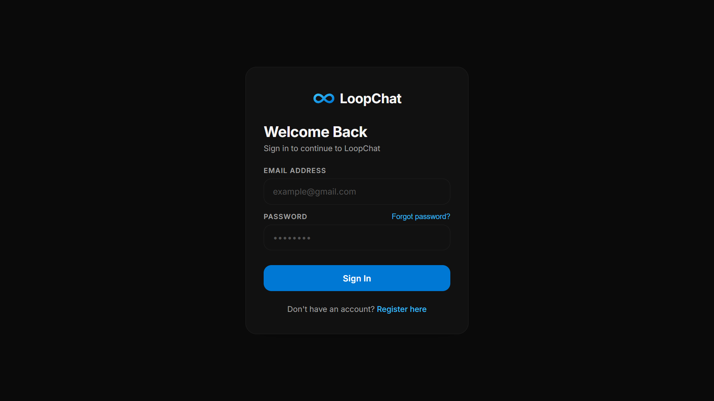
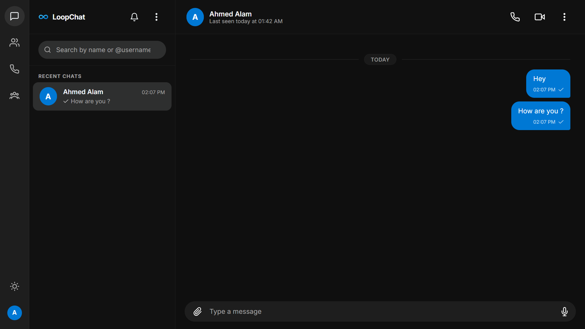
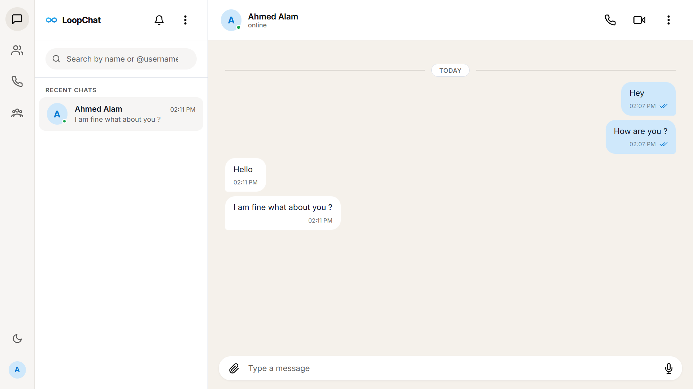
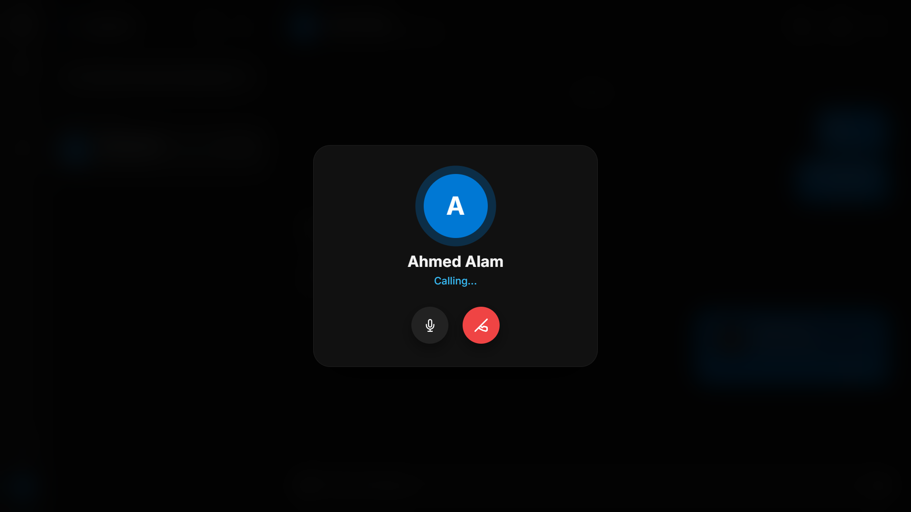

# LoopChat

> A full-stack, real-time messaging application built with the **MERN stack** and **Socket.IO** — featuring end-to-end chat, WebRTC voice & video calls, friend system, group chats, and more.

---

## ✨ Features

### 💬 Messaging
- Real-time one-on-one and group messaging via **Socket.IO**
- Send text, images, videos, audio files, documents
- **Voice notes** — record and send directly in-chat
- **Reply-to** — quote any message for context
- **Forward** messages to any contact or group
- **Read receipts** — double tick (✓✓) with blue state when read
- **Typing indicator** with animated dots
- **Audio recording indicator** — live status while peer records
- **Message reactions** — emoji react to any message
- **Delete messages** for everyone instantly

### 🧑‍🤝‍🧑 Contacts & Friends
- Friend request system (send / accept / decline / cancel)
- Real-time friend request notifications with toasts
- Remove / Block / Unblock contacts
- Contact search with live availability check

### 📞 Calls
- **WebRTC** powered peer-to-peer voice and video calls
- Call history log with missed / received / dialled indicators
- Call duration tracking
- Mute mic and toggle camera during calls

### 👥 Groups
- Create group chats with multiple members
- Group admin controls
- Leave group

### 🔐 Authentication
- Email + Password registration
- **OTP email verification** on signup
- **Forgot password** with OTP-based reset flow
- JWT-based session management

### 🎨 UI / UX
- **Dark Mode** and **Light Mode** with instant persistence
- WhatsApp / Messenger inspired bubble design
- Smooth micro-animations and transitions
- Responsive layout — works on mobile, tablet, desktop
- Empty states with helpful illustrations
- Drag & Drop file attachment

---

## 🛠 Tech Stack

| Layer | Technology |
|---|---|
| **Frontend** | React 19, Vite, Vanilla CSS |
| **Backend** | Node.js, Express 5 |
| **Database** | MongoDB (Mongoose) |
| **Real-time** | Socket.IO |
| **Calls** | WebRTC (RTCPeerConnection) |
| **Auth** | JWT, bcryptjs |
| **Email** | Nodemailer (Gmail SMTP) |
| **File Storage** | Cloudinary + local `/uploads` |
| **Icons** | Lucide React, React Icons |

---

## 📁 Project Structure

```
loopchat/
├── client/                  # React frontend (Vite)
│   ├── src/
│   │   ├── components/      # CallModal, OTPVerification, LoopChatLogo
│   │   ├── pages/           # Chat.jsx, Login.jsx, Register.jsx
│   │   ├── config.js        # Central API endpoint config
│   │   └── index.css        # Global design system & tokens
│   ├── .env.example
│   └── vite.config.js
│
└── server/                  # Node.js + Express backend
    ├── config/              # DB connection
    ├── controllers/         # Route handlers
    ├── middleware/          # Auth, upload, error middleware
    ├── models/              # Mongoose schemas
    ├── routes/              # Express routers
    ├── utils/               # Email sender
    ├── uploads/             # Local file storage
    ├── .env.example
    └── server.js            # Entry point + Socket.IO
```

---

## 🚀 Quick Start (Local)

### Prerequisites
- Node.js >= 18
- MongoDB Atlas cluster (or local MongoDB)
- Gmail account with **App Password** enabled (for OTP emails)

---

### 1. Clone the repository

```bash
git clone https://github.com/ahmedaalam/loopchat.git
cd loopchat
```

---

### 2. Setup the Server

```bash
cd server
npm install
cp .env.example .env
```

Fill in `server/.env`:
```env
PORT=5000
MONGO_URI=mongodb+srv://<user>:<pass>@cluster.mongodb.net/loopchat
JWT_SECRET=your_super_secret_key
CLIENT_URL=http://localhost:5173
EMAIL_SERVICE=gmail
EMAIL_USER=your_email@gmail.com
EMAIL_PASS=your_google_app_password
```

Start the server:
```bash
npm run dev
```

---

### 3. Setup the Client

```bash
cd client
npm install
cp .env.example .env
```

Fill in `client/.env`:
```env
VITE_API_ENDPOINT=http://localhost:5000
```

Start the dev server:
```bash
npm run dev
```

Open **http://localhost:5173** in your browser.

---

## 🌐 Deployment

### Backend → Render / Railway

1. Push `server/` to GitHub
2. Create a new **Web Service** on [Render](https://render.com) or [Railway](https://railway.app)
3. Set **Build Command**: `npm install`
4. Set **Start Command**: `npm start`
5. Add all `.env` variables in the service dashboard
6. Set `CLIENT_URL` to your Vercel frontend URL

### Frontend → Vercel / Netlify

1. Push `client/` to GitHub
2. Import project into [Vercel](https://vercel.com)
3. Set **Build Command**: `npm run build`
4. Set **Output Directory**: `dist`
5. Add environment variable: `VITE_API_ENDPOINT=https://your-render-backend.onrender.com`

---

## 📡 API Endpoints

### Auth — `/api/auth`
| Method | Endpoint | Description |
|---|---|---|
| POST | `/register` | Register new user |
| POST | `/login` | Login |
| POST | `/verify-otp` | Verify email OTP |
| POST | `/resend-otp` | Resend OTP |
| POST | `/forgot-password` | Send reset OTP |
| POST | `/verify-reset-otp` | Verify reset OTP |
| POST | `/reset-password` | Set new password |

### Users — `/api/users`
| Method | Endpoint | Description |
|---|---|---|
| GET | `/` | Search users |
| GET | `/check-username` | Check username availability |
| PUT | `/profile` | Update profile |
| GET | `/profile/:userId` | Get user profile |
| POST | `/block/:id` | Block user |
| POST | `/unblock/:id` | Unblock user |

### Chats — `/api/chat`
| Method | Endpoint | Description |
|---|---|---|
| POST | `/` | Access / create 1-on-1 chat |
| GET | `/` | Fetch all chats |
| POST | `/group` | Create group chat |
| PUT | `/:chatId/clear` | Clear chat messages |
| DELETE | `/:chatId` | Delete chat |

### Messages — `/api/message`
| Method | Endpoint | Description |
|---|---|---|
| POST | `/` | Send message |
| GET | `/:chatId` | Get messages |
| PUT | `/:chatId/read` | Mark as read |
| PUT | `/:messageId/react` | Toggle reaction |
| DELETE | `/:messageId` | Delete message |
| DELETE | `/calls/clear` | Clear call logs |

### Friends — `/api/friends`
| Method | Endpoint | Description |
|---|---|---|
| POST | `/request/:userId` | Send friend request |
| POST | `/accept/:requestId` | Accept request |
| POST | `/decline/:requestId` | Decline request |
| DELETE | `/cancel/:requestId` | Cancel sent request |
| GET | `/requests` | Get pending requests |
| GET | `/` | Get accepted friends |
| DELETE | `/:userId` | Remove friend |
| GET | `/status/:userId` | Get friendship status |

---

## 📸 Screenshots

### Login


### Chat UI (Dark)


### Chat UI (Light)


### Call Feature

---

## 🔗 Live Demo

https://loopchat-web.vercel.app/

---

## 📄 License

[MIT](LICENSE) — Ahmed Alam © 2026
